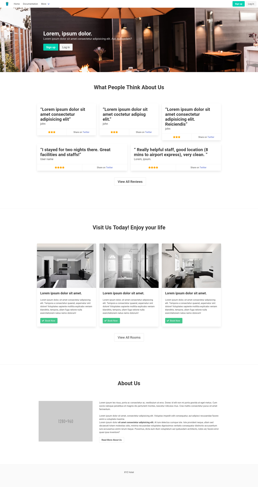
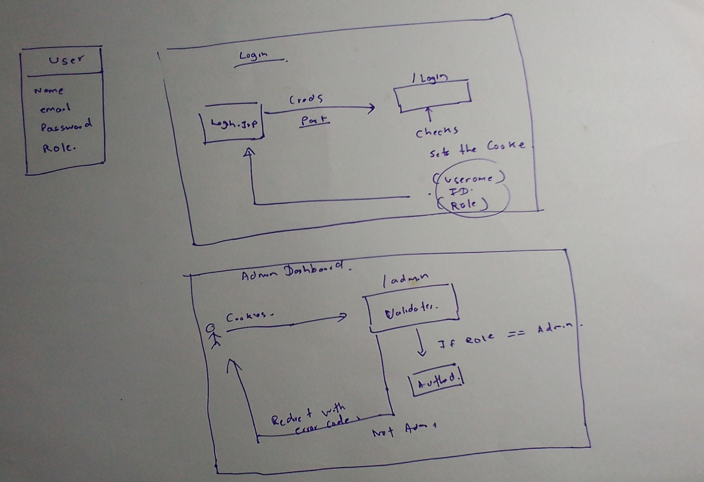
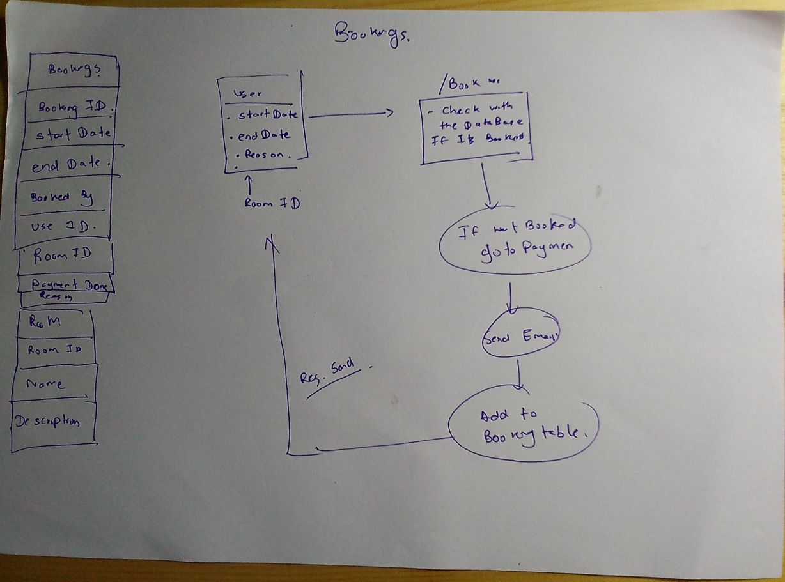

# Project

### Project Screenshot




### Requirements

- [ ] online reservations
- [ ] avoid booking collisions
- [x] visualization of customer feedback for management
- [ ] SMS and Email notification of reservation and cancelling options
- [ ] payment handling

### Project Structure

```
.
├── pom.xml
├── src
│   ├── main
│   │   ├── java
│   │   │   └── com
│   │   │       └── example
│   │   │           └── xyzhotel
│   │   │               ├── beans
│   │   │               │   ├── review.java
│   │   │               │   └── room.java
│   │   │               ├── dao
│   │   │               │   ├── ApplicationDao.java
│   │   │               │   ├── dbconnection.java
│   │   │               │   └── homeInfo.java
│   │   │               ├── HelloServlet.java
│   │   │               └── servletz
│   │   │                   ├── allRooms.java
│   │   │                   ├── home.java
│   │   │                   └── login.java
│   │   ├── resources
│   │   └── webapp
│   │       ├── css
│   │       │   └── custom.css
│   │       ├── index.html
│   │       ├── jsp
│   │       │   ├── login.jsp
│   │       │   ├── partials
│   │       │   │   ├── footer.jsp
│   │       │   │   └── navbar.jsp
│   │       │   ├── rooms.jsp
│   │       │   └── thehomepage.jsp
│   │       ├── static
│   │       │   └── img
│   │       │       └── hero.webp
│   │       └── WEB-INF
│   │           ├── lib
│   │           │   └── mysql-connector-java-8.0.27.jar
│   │           └── web.xml
│
└── xyzhotel.iml
```

### Desgin Diagrams






### Database Structure

```sql
-- create database

CREATE DATABASE xyzhotel;

USE xyzhotel;

-- creating bookings table

CREATE TABLE bookings (
    booking_id int NOT NULL ,
    start_date date  NOT NULL,
    end_date date  NOT NULL,
    booked_by INt  NOT NULL,
    room_id INT  NOT NULL,
    paymentAmount float  NOT NULL,
    ispayment_done bool  NOT NULL,
    reason varchar(256),
    PRIMARY KEY (booking_id),
    FOREIGN KEY (room_id) REFERENCES room_info(room_id),
    FOREIGN KEY (booked_by) REFERENCES users(uuid)
);

-- create table rooms

CREATE TABLE room_info (
    room_id int NOT NULL,
    title varchar(256) NOT NULL,
    room_description varchar(256) NOT NULL,
    room_image varchar(256) NOT NULL,
    PRIMARY KEY (room_id)
);

ALTER TABLE room_info MODIFY COLUMN room_id INT auto_increment;

-- users table

CREATE TABLE users
(
  uuid int,
  email varchar(255) NOT NULL,
  password VARCHAR(255) NOT NULL,
  role varchar(255) DEFAULT 'user' ,
  PRIMARY KEY(uuid)
);

-- create reviews table
CREATE TABLE reviews(
    review_id int,  
    review_content varchar(255) NOT NULL, 
    review_starts int,
    review_user VARCHAR(255) NOT NULL,
    PRIMARY KEY(review_id) 
);

ALTER TABLE reviews MODIFY COLUMN review_id INT auto_increment;

```

test
